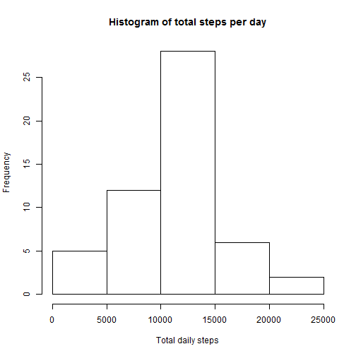
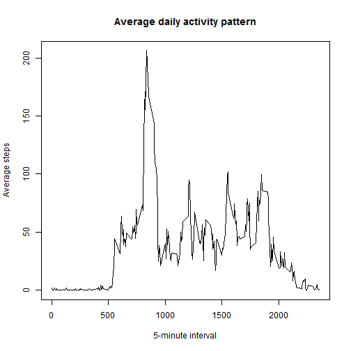
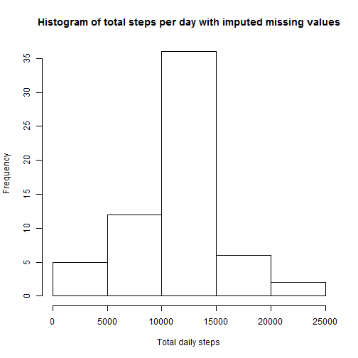
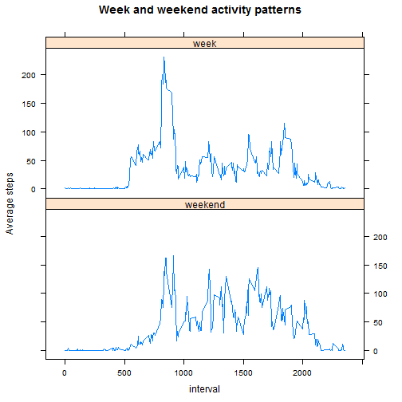

# Reproducible Research: Peer Assessment 1

Data provided for this assignment came from a personal activity monitoring device worn by an anonymous individual during October and November, 2012. The device recorded the number of steps taken in 5 minute intervals each day.

## Loading and preprocessing the data

```r
#load packages, set options
library(doBy)
library(lattice)
options("scipen"=10)
```


```r
#load and inspect the data provided
adata <- read.csv("activity.csv",header=TRUE,sep=",")
head(adata)
```

```
##   steps       date interval
## 1    NA 2012-10-01        0
## 2    NA 2012-10-01        5
## 3    NA 2012-10-01       10
## 4    NA 2012-10-01       15
## 5    NA 2012-10-01       20
## 6    NA 2012-10-01       25
```

```r
str(adata)
```

```
## 'data.frame':	17568 obs. of  3 variables:
##  $ steps   : int  NA NA NA NA NA NA NA NA NA NA ...
##  $ date    : Factor w/ 61 levels "2012-10-01","2012-10-02",..: 1 1 1 1 1 1 1 1 1 1 ...
##  $ interval: int  0 5 10 15 20 25 30 35 40 45 ...
```
According to assignment instructions, missing values in the data were ignored in preliminary analyses. They were evaluated at a later stage, see 'Imputing missing values' below.


```r
# add variables for day-of-year and day-of-week
tmp <- as.POSIXlt(adata$date, format = "%Y-%m-%d")
adata$yearday <- tmp$yday
adata$dayweek <- weekdays(tmp)
```

## What is mean total number of steps taken per day?


```r
#calculate daily totals and produce histogram
day.summary <- summaryBy(steps ~ yearday, data = adata, FUN = sum)
hist(day.summary$steps.sum, main = "Histogram of total steps per day", xlab = "Total daily steps")
```

 

Mean total steps per day: 10766

Median total steps per day: 10765

## What is the average daily activity pattern?
Activity was evaluated by plotting the daily average number of steps for each 5-minute interval.


```r
#calculate totals for 5-minute intervals and plot daily pattern
int.summary <- summaryBy(steps ~ interval, data = adata, FUN = mean, na.rm = TRUE)
plot(steps.mean ~ interval, data = int.summary, type = "l", xlab = "5-minute interval", ylab = "Average steps", main = "Average daily activity pattern")
```

 

The maximum number of steps (averaged over all days) was recorded in time interval 835.


## Imputing missing values
The variable 'steps' had a total of 2304 missing values coded NA.

Variable 'date' had 0 missing values.

Variable 'length' had 0 missing values.

A new dataset ('impdata') was created, containing the original data and imputed values. A simple imputation method was adopted. The overall mean number of steps (rounded to integer) for the respective 5-minute interval was used to replace each NA value. 


```r
#create new dataset and impute missing values
impdata <- adata
for (j in (1:length(unique(impdata$interval)))){
    this.int <- unique(impdata$interval)[j]
    impdata$steps[impdata$interval == this.int & is.na(impdata$steps)] <- round(int.summary$steps.mean[int.summary$interval == this.int],0)
}
```


```r
#calculate daily totals including imputed values and produce histogram
imp.day.summary <- summaryBy(steps ~ yearday, data = impdata, FUN = sum)
hist(imp.day.summary$steps.sum, main = "Histogram of total steps per day with imputed missing values", xlab = "Total daily steps")
```

 

Imputing missing data had very little impact on the present analyses, as shown by the following details:

Mean total steps per day with imputed values was 
10766.

For mean total steps per day, the difference between original and imputed data was   
0.5 steps.

Median total steps per day with imputed values was 
10762.

For median total steps per day, the difference between original and imputed data was
3 steps.

## Are there differences in activity patterns between weekdays and weekends?
The data set containing imputed missing values was used to evaluate activity during weekdays and weekends.


```r
#calculate mean values separately for weekdays and weekend days and plot in two panels
wkend <- c("Saturday", "Sunday")
impdata$period <- "week"
impdata$period[impdata$dayweek %in% wkend] <- "weekend"
impdata$period <- as.factor(impdata$period)
imp.int.summary <- summaryBy(steps ~ interval+period, data = impdata, FUN = mean)
xyplot(steps.mean ~ interval|period, data = imp.int.summary, type = "l", x.lab = "5-minute interval", ylab = "Average steps", main = "Week and weekend activity patterns", layout = c(1,2), as.table = TRUE)
```

 

Weekday and weekend activity were notably different, as shown in the plot above.


